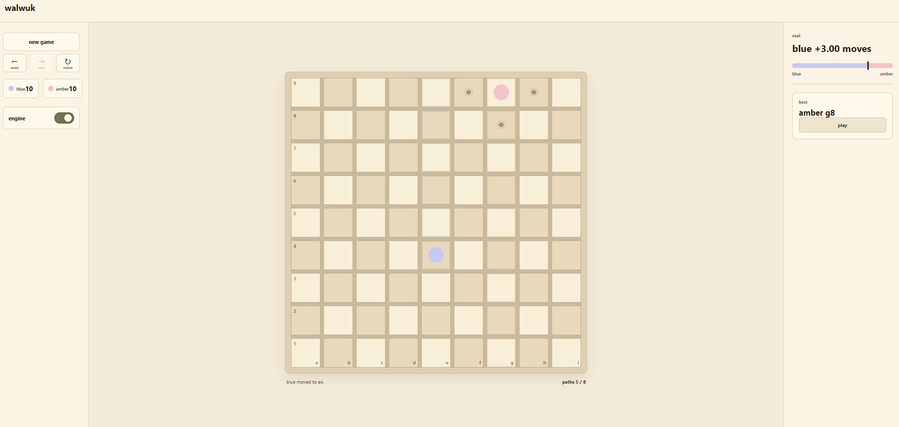

# walwuk

walwuk is a browser-based position analyzer for the Wallz board game. It combines an interactive 9×9 board with a C++/WebAssembly, Stockfish-inspired search engine that evaluates routes, walls, mobility, and forced wins.

**[play walwuk](https://souuk.github.io/walwuk/)**



## Contents

- [What walwuk does](#what-walwuk-does)
- [The game model](#the-game-model)
- [Using the application](#using-the-application)
- [How the algorithm works](#how-the-algorithm-works)
- [Reading the analysis](#reading-the-analysis)
- [Local development](#local-development)
- [Validation](#validation)
- [Deployment](#deployment)
- [Contributing](#contributing)
- [Known limitations](#known-limitations)
- [License](#license)

## What walwuk does

walwuk lets you construct and analyze positions rather than forcing you to play a complete game from the starting position. You can move either pawn, place legal walls, rotate the board, and use undo/redo to inspect alternatives.

The engine can be toggled on or off. When it is enabled, it searches from the current position and reports the strongest move it found within the selected time and depth limits. The C++ engine runs as WebAssembly inside a Web Worker, so searching does not freeze the board controls. A TypeScript implementation remains as a temporary compatibility fallback and correctness reference.

### Features

- Editable 9×9 board with legal pawn movement and wall placement.
- Periwinkle and blossom player colors.
- New game, undo, redo, left/right arrow-key history controls, and board rotation.
- Engine toggle with exponential-style thinking-time presets from 250 ms to 30 s.
- Search-depth control from 2 to 12 ply.
- Evaluation bar, best move, shortest paths, node count, search speed, and transposition-table statistics.
- Board interaction locks after a win and finishes with a winner-colored animation.

## The game model

The board has 81 pawn squares arranged as a 9×9 grid. Walls occupy the spaces between squares and can be horizontal or vertical. Each player starts with one pawn and ten walls.

Periwinkle starts at the bottom and tries to reach the top row. Blossom starts at the top and tries to reach the bottom row. A player wins immediately when their pawn reaches their target row.

The engine stores a complete position in a `GameState` object from [`app/engine.ts`](app/engine.ts):

```ts
export interface GameState {
  pawns: [Square, Square];
  walls: Wall[];
  wallsLeft: [number, number];
  turn: Player;
}
```

`pawns[0]` is periwinkle, `pawns[1]` is blossom, and `turn` identifies the player whose move is next. A move is either a pawn move or a wall move:

```ts
export type PawnMove = { kind: "pawn"; to: Square };
export type WallMove = { kind: "wall"; wall: Wall };
export type Move = PawnMove | WallMove;
```

## Using the application

1. Click a softly marked destination square to move the current pawn.
2. Click an empty wall slot to place a legal horizontal or vertical wall.
3. Select **new game** to reset the position.
4. Select **undo** or **redo**, or press the left and right arrow keys, to navigate move history.
5. Select **rotate** to view the board from the opposite orientation.
6. Toggle **engine** to start or pause analysis.
7. Adjust **thinking time** to change the time budget and **depth** to change the maximum search depth.
8. Select **play** on the best-move card to apply the engine’s current recommendation.

The board cannot be edited after a player wins. The engine also stops searching at that point, and no best move is offered for a finished position.

### Paths

The status line shows `paths x / y`:

- `x` is periwinkle’s shortest currently available route to the top goal;
- `y` is blossom’s shortest currently available route to the bottom goal.

These are distances in pawn moves, not a prediction of the final score. A wall can increase one path, decrease another, or make a different route become shortest.

### Depth and ply

A **ply** is one move by one player. A periwinkle move is one ply; blossom’s reply is a second ply. Therefore, a search of 12 ply can examine up to six complete periwinkle/blossom turns along a line.

Greater depth usually gives the engine more tactical foresight, but it also increases the number of positions it must inspect. The time limit still takes precedence: if the timer expires during a depth, walwuk returns the last depth that completed fully.

## How the algorithm works

The production search is implemented in [`engine-native/walwuk_engine.cpp`](engine-native/walwuk_engine.cpp), compiled to WebAssembly with Emscripten, and coordinated by [`app/engine-worker.ts`](app/engine-worker.ts). Individual root partitions run through [`app/search-worker.ts`](app/search-worker.ts). [`app/engine.ts`](app/engine.ts) contains the readable TypeScript rules, UI helpers, move explanations, and temporary reference search.

```text
react interface
    ↓ position + limits
coordinating web worker
    ↓ main and verifier lanes
up to 75% of reported logical processors
    ↓ selective main partitions + exhaustive verifier partitions
coordinating web worker
    ↓ latest depth completed by every partition
    ↓ progress / final result
react interface
```

The pool is capped at `floor(0.75 × navigator.hardwareConcurrency)` and by known WebAssembly allocations; there is no separate arbitrary worker ceiling. Each isolated worker currently reserves 96 MiB, the fallback engine budget is 256 MiB when device memory is unavailable, and reported memory is discounted because the browser exposes only a coarse estimate. Approximately three quarters of the workers deepen the main selective search while one quarter run the exhaustive verifier. A one-worker device time-slices both lanes and uses a 3:1 active/idle duty cycle.

The main lane searches every legal root move, then uses plausible internal walls, ordering, reductions, and shallow pruning to reach farther. The verifier searches every legal move exhaustively to a shallower but reliable depth. Until same-depth root-score verification is available, any disagreement uses the verifier's move; the deeper main move is accepted when both lanes agree. The console therefore reports **main**, **verified**, and **seldepth** separately rather than implying that the deepest selective iteration is exhaustive.

Wall candidates are generated structurally first. Path and route-existence work is deferred until alpha-beta actually searches a candidate, so cutoffs avoid preparing most possible wall children. Timed production searches may reuse deeper valid transposition bounds, while deterministic parity requests retain strict horizon matching. Workers and WebAssembly instances persist across bounded analysis epochs, so compatible transposition entries, move histories, and principal variations survive deeper iterations and an observed move. The visible suggestion is still cleared immediately when the board changes. Exactly symmetric roots search one representative of each left-right pair. Positions that begin with both wall reserves empty use a cached exact retrograde solver for the fixed wall topology.

JavaScript crosses into each WebAssembly instance only when a search starts, when progress is reported, and when the final result is returned. Move generation, pathfinding, evaluation, recursion, pruning, and caching stay inside native code during a search.

At a high level, every analysis follows this pipeline:

```text
current position
    ↓
generate every legal pawn and wall move
    ↓
order promising moves first
    ↓
search each candidate recursively
    ↓
evaluate leaf positions and terminal wins
    ↓
prune branches that cannot improve the result
    ↓
cache reusable positions
    ↓
repeat at greater depths until the limit or timer is reached
    ↓
return the best move from the deepest completed search
```

### 1. Detecting walls between squares

Before a pawn can move, the engine checks whether a wall blocks the edge between its current square and its destination. Horizontal walls block vertical movement; vertical walls block horizontal movement.

```ts
export function blocked(a: Square, b: Square, walls: Wall[]): boolean {
  if (a.r !== b.r) {
    const row = Math.min(a.r, b.r);
    return walls.some(
      (w) => w.o === "h" && w.r === row &&
        (w.c === a.c || w.c + 1 === a.c),
    );
  }

  const col = Math.min(a.c, b.c);
  return walls.some(
    (w) => w.o === "v" && w.c === col &&
      (w.r === a.r || w.r + 1 === a.r),
  );
}
```

This function is the basic collision rule used by pawn movement, pathfinding, and wall legality.

### 2. Generating pawn moves

The engine checks the four neighboring squares. A normal destination is accepted when it is inside the board and not blocked:

```ts
if (!inside(adjacent) || blocked(own, adjacent, state.walls)) continue;
if (!sameSquare(adjacent, other)) {
  destinations.push(adjacent);
  continue;
}
```

When the opponent’s pawn is directly adjacent, walwuk first tries to jump over it:

```ts
const beyond = { r: other.r + dr, c: other.c + dc };
if (inside(beyond) && !blocked(other, beyond, state.walls)) {
  destinations.push(beyond);
  continue;
}
```

If a wall prevents the jump, the engine adds side-step squares beside the opposing pawn. Destinations are deduplicated before they become `PawnMove` objects.

### 3. Validating wall moves

Walls are rejected if they are outside the wall grid, if the current player has none remaining, or if they overlap or cross an existing wall. The engine then tests the important rule that both players must retain at least one route to their goal:

```ts
const trial = { ...state, walls: [...state.walls, wall] };
return shortestPath(trial, 0).distance < 99 &&
       shortestPath(trial, 1).distance < 99;
```

The trial position is only used for validation. The wall is added to the real position later by `applyMove` if the move is selected.

### 4. Finding shortest paths

`shortestPath` uses breadth-first search. Breadth-first search is appropriate here because every pawn step has the same cost: one move.

```ts
const queue: Square[] = [start];
const seen = new Set([`${start.r},${start.c}`]);
```

The search explores reachable squares until it finds the player’s target row. It records each square’s parent so it can reconstruct one shortest route, not just the distance.

```ts
if (current.r === targetRow) {
  const path = [current];
  // follow parent links back to the starting square
  path.reverse();
  return { distance: path.length - 1, path };
}
```

The same pathfinder is used in three places:

1. to display the current path lengths;
2. to evaluate a position;
3. to reject walls that close every route.

### 5. Generating and verifying walls

The main engine retains every legal pawn and wall move at the root. At internal nodes it limits wall analysis to plausible placements: walls that touch either player's current shortest-path witness or lie near either pawn. Each retained wall still passes overlap, crossing, wall-reserve, and route-existence validation:

```cpp
if (WallTouchesWitness(paths[0], id, vertical) ||
    WallTouchesWitness(paths[1], id, vertical)) {
  return true;
}
// The remaining code retains anchors within one row and column of either pawn.
if (row_distance <= 1 && column_distance <= 1) {
  return true;
}
```

At non-root nodes through depth five, a depth-dependent move-count threshold can also prune late, low-priority wall candidates after stronger moves have been searched. This is deliberately selective: a legal but implausible internal wall can be omitted. The parallel verifier searches the exhaustive native tree independently, while the TypeScript engine remains a compatibility fallback and differential reference.

The native pathfinder expands the 81 squares as compact bit sets, moves are applied and undone in place, and child path results are carried into recursion. These representation optimizations reduce the cost of every retained branch.

### 6. Evaluating a position

If the search reaches its depth limit without a win, it uses a static evaluation. The absolute score combines three practical signals:

```ts
const pathScore = (blossomDistance - periwinkleDistance) * 100;
const wallScore = wallReserveValue(state.wallsLeft[0])
  - wallReserveValue(state.wallsLeft[1]);
const mobility = (mobilityBlue - mobilityAmber) * 4;
return pathScore + wallScore + mobility;
```

The path term is intentionally strongest. Being one move closer to goal is worth substantially more than having one extra wall or one extra legal move. The wall and mobility terms help break ties and recognize positions where a player has more flexibility.

Scores are always converted to the perspective of the side whose turn it is:

```ts
return state.turn === 0 ? absolute : -absolute;
```

That convention lets one recursive function evaluate both players consistently.

### 7. Detecting wins

The win test is simple:

```ts
export function winner(state: GameState): Player | null {
  if (state.pawns[0].r === 0) return 0;
  if (state.pawns[1].r === 8) return 1;
  return null;
}
```

Wins receive a score far larger than normal positional differences:

```ts
const WIN = 100_000;
```

During recursive search, the score is adjusted by the distance in plies to prefer a quicker win and resist a loss for as long as possible:

```ts
if (won !== null) return won === state.turn
  ? WIN - ply
  : -WIN + ply;
```

### 8. Searching with negamax

walwuk uses negamax, a compact form of minimax. Instead of writing separate “max” and “min” functions, it always searches from the current player’s perspective and negates the child result:

```ts
const score = -negamax(
  applyMove(state, move),
  depth - 1,
  -beta,
  -alpha,
  ply + 1,
);
```

If a child position is good for the opponent, negating its score makes it bad for the current player. This allows the same code to handle both sides.

The engine keeps the highest-scoring move at each node:

```ts
if (score > bestScore) {
  bestScore = score;
  best = move;
}
```

### 9. Pruning with alpha-beta bounds

Alpha-beta pruning avoids searching moves that cannot change the decision. `alpha` is the best score already guaranteed to the current player. `beta` is the threshold at which the opponent has found a better alternative elsewhere.

```ts
alpha = Math.max(alpha, score);
if (alpha >= beta) break;
```

When `alpha` reaches or exceeds `beta`, the remaining moves at that node cannot produce a better usable result, so the branch is cut off.

This does not mean the engine has proven every skipped move is objectively losing. It means those moves cannot improve the decision relative to a line already found within the current search window.

The native engine also uses principal variation search. It searches the first, most promising move with the full alpha-beta window, then tests later moves with a one-point window. Any later move that might improve the result is immediately searched again with the full window:

```cpp
score = -Negamax(position, child_paths, depth - 1, -alpha - 1, -alpha, ply + 1);
if (score > alpha && score < beta) {
  score = -Negamax(position, child_paths, depth - 1, -beta, -alpha, ply + 1);
}
```

The narrow probe itself is an exact alpha-beta optimization within the retained candidate set: a potentially better reduced move receives the full search needed to establish its score.

### 10. Caching repeated positions

Different move orders can lead to the same position. Each C++ worker stores analyzed positions in a fixed-size, contiguous transposition table organized into four-entry clusters. Each entry contains both wall masks, packed pawn/reserve/turn metadata, the searched depth, score bound, generation, and best move. A cluster retains several positions with the same table index and replaces empty, older, or shallower entries first.

The table is not destroyed after every request. When a played move reaches a position already analyzed in the previous principal variation or another branch, the next search can reuse its exact score or alpha-beta bound. Full packed-position verification prevents a hash collision from returning an incorrect score. The engine reports these cross-request hits separately as `reused nodes`; a clear command or incompatible engine/evaluator version invalidates them.

The readable TypeScript reference represents the same identity with a map:

```ts
const tt = new Map<string, TTEntry>();
```

The key includes the side to move, both pawn locations, remaining walls, and a sorted representation of placed walls:

```ts
return `${state.turn}|${state.pawns[0].r}${state.pawns[0].c}|` +
  `${state.pawns[1].r}${state.pawns[1].c}|` +
  `${state.wallsLeft.join(",")}|${walls}`;
```

The native table hashes that identity to a cluster but verifies the complete packed identity before using an entry. A collision can therefore replace or miss a cached result, but cannot return another position's score. A result is reused only when it was searched deeply enough:

```ts
    if (cached && cached.depth === depth) {
  ttHits++;
  // use the cached exact or bounded result
}
```

### 11. Ordering moves before searching

Alpha-beta pruning is most effective when strong moves are searched first. walwuk assigns priorities to moves before recursion:

```ts
let priority = ttMove && moveKey(ttMove) === moveKey(move)
  ? 1_000_000
  : 0;
```

Immediate wins receive a large bonus:

```ts
if (winner(next) === state.turn) priority += 500_000;
```

Pawn moves toward the goal and walls that lengthen the opponent’s shortest path are also preferred. This is a performance optimization: it changes the order of exploration, not the rules of the game.

### 12. Iterative deepening

The engine searches one depth at a time:

```ts
for (let depth = 1; depth <= limits.maxDepth; depth++) {
```

At the end of every completed depth, it saves the current best move and principal variation. If the timer expires during the next depth, the previous completed result remains safe to return.

For deeper searches, it first uses a narrow aspiration window around the previous score:

```ts
alpha = completed.score - 175;
beta = completed.score + 175;
```

If the score falls outside that window, it retries the depth with the full score range:

```ts
if (score <= alpha || score >= beta) {
  score = negamax(initial, depth, -INF, INF, 0);
}
```

### 13. Time management

The engine creates a deadline from the configured thinking time:

```ts
const started = performance.now();
const deadline = started + limits.timeMs;
```

Both engines check the clock every 256 searched nodes. The TypeScript reference expresses the check as:

```ts
if ((nodes & 255) === 0 && timedOut()) {
  throw new Error("timeout");
}
```

The native search uses a timeout flag instead of throwing through C++ search frames. Both engines stop cleanly and return the last fully completed depth. Results carry an internal stop reason (`depth`, `time`, `cancelled`, or `error`) so a time-limited result is distinguishable from completing the requested depth.

### 14. Principal variation and worker communication

The principal variation (PV) is the engine’s current predicted sequence of best moves. walwuk reconstructs it by following the best cached move from the original state:

```ts
const move = tt.get(stateKey(state))?.best;
if (!move) break;
pv.push(move);
state = applyMove(state, move);
```

The TypeScript reference shows the same progress contract in its simplest form:

```ts
self.onmessage = (event) => {
  const result = analyze(event.data.state, event.data.limits, (progress) => {
    self.postMessage({ type: "progress", result: progress });
  });
  self.postMessage({ type: "done", result });
};
```

The production coordinator starts a pool of isolated WebAssembly workers and forwards the aggregated messages. The UI starts a fresh analysis whenever the position, engine toggle, time limit, or depth changes. An obsolete pool is terminated immediately, as is the active pool when the engine is turned off or the game ends. If the full pool cannot initialize, walwuk retries with one WebAssembly worker; if that also fails, it reports the fallback and runs the TypeScript engine instead.

## Reading the analysis

- **eval**: the engine’s current score from periwinkle’s perspective. Positive values favor periwinkle; negative values favor blossom.
- **even**: the current evaluation is approximately balanced.
- **`periwinkle +3.00 moves`**: the handcrafted evaluation favors periwinkle by roughly three path-equivalent moves. This is not a literal score or guaranteed result.
- **forced win**: the search found a terminal winning line within the completed search horizon.
- **best**: the first move in the current principal variation.
- **main**: the deepest fully completed selective search depth.
- **verified**: the deepest fully completed exhaustive verifier depth.
- **seldepth**: the deepest individual line reached after bounded extensions.
- **provisional**: the main and verifier have not yet agreed or established a safety override.
- **verified result**: the exhaustive lane agrees with the move or overrides a disagreement.
- **nodes**: positions searched.
- **nps**: nodes per second.
- **tt hits**: positions answered from the transposition table instead of being searched again.

## Local development

Requires Node.js 22.13.0 or newer and Emscripten 6.0.6. Install and activate the pinned SDK through [emsdk](https://github.com/emscripten-core/emsdk):

```bash
git clone https://github.com/emscripten-core/emsdk.git .emsdk
./.emsdk/emsdk install 6.0.6
./.emsdk/emsdk activate 6.0.6
```

On Windows, use `emsdk.bat` for the last two commands. The build helper automatically detects an SDK installed in the repository's ignored `.emsdk` directory. If Emscripten is installed elsewhere, activate its environment before running npm commands.

```bash
npm install
npm run dev
```

`npm run dev` compiles the C++ engine and then starts Vite. Generated `.mjs` and `.wasm` files are placed under `public/engine/`, copied into the static build, and intentionally excluded from Git.

## Validation

Run all checks before opening a pull request:

```bash
npm run engine:test:full
npm run engine:test:stress
npm run engine:test:million
npm run engine:benchmark
npm run engine:benchmark:accuracy -- --time-ms 1000 --max-depth 15
npm run engine:benchmark:matrix
npm run engine:build:profile
npm run engine:build:simd-experiment
npm run engine:audit -- --depth 3 --random 32 --output outputs/root-audit.json
npm run engine:tournament -- --pairs 6
npm run engine:benchmark:persistence -- --time-ms 1000
npm run engine:campaign -- --duration-minutes 120 --workers 8
npm run engine:campaign:report -- --directory outputs/campaigns/phase2-pilot
npm run engine:test:experiments
npm run engine:campaign -- --match-mode ab --module outputs/phase2-experimental/walwuk-engine.mjs --challenger-mask 8192 --nodes 50000 --output outputs/campaigns/multicut-fixed-node
npm run engine:match:ab -- --candidate-mask 8192 --baseline-mask 0 --games 8
npm run engine:match:ab -- --candidate-mask 8192 --baseline-mask 0 --nodes 50000 --games 8
npm run engine:match:clock -- --games 2
npm run lint
npm run typecheck
npm run build
```

`engine:test:full` compares both exhaustive searches through 3 ply on curated positions, checks movement, every legal wall, ordering, paths, and evaluation on 2,000 deterministic random positions, validates hybrid result metadata, and exercises CPU/memory budgeting. `engine:test:stress` expands the deterministic rule-parity sample to 100,000 positions. `engine:test:million` is the release gate: it streams one million comparisons through deterministic independent shards while capping concurrency at 75% of reported processors and the conservative known-memory limit. `engine:benchmark` reports TypeScript and WebAssembly NPS. `engine:benchmark:accuracy` records depth, seldepth, effective branching factor, cutoffs, reductions, re-searches, pruned moves, and selective/exhaustive disagreement; use `--positions opening,"low reserves"` to select fixtures. `engine:benchmark:persistence` compares a cleared search with a warm same-position search and a warm rebase after the expected move. `engine:benchmark:matrix` runs the standard 250 ms through 15 second matrix and records environment plus engine hashes. `engine:build:profile` enables diagnostic path, candidate, child-preparation, and TT counters which compile out of production builds. `engine:build:simd-experiment` creates a separate SIMD/autovectorized artifact that must pass parity and timing tests before promotion. `engine:audit` exhaustively scores every legal root move and records the selective move's regret; `--random` adds reproducible legal positions. Pass `--output report.json` to retain a machine-readable report. `engine:tournament` runs color-swapped matches concurrently. `engine:campaign` adds resumable ten-minute checkpoints, a 22.5 GiB generation stop, score-by-color and game-length reporting, and CPU/memory job caps; it supports standard or A/B matches under time or fixed-node budgets, retries the same opening after an infrastructure failure, and refuses to mix changed engines or settings into a checkpoint. Creating its configured `stop.request` marker ends it after active jobs and writes a durable checkpoint. `engine:match:ab` directly compares two experiment masks in paired, color-swapped games, with either equal time or `--nodes` budgets. `engine:match:clock` simulates the competitive 180-second clock with a one-second increment and 15-second per-move ceiling. `npm run build` creates the GitHub Pages output in `dist-pages`.

Offline evaluator data can be generated without changing production behavior:

```bash
npm run engine:data -- --output training.jsonl --positions 1000 --time-ms 1000
npm run engine:train:policy -- training.jsonl --output public/engine/assets/policy.wlp
npm run engine:train:value -- training.jsonl --output public/engine/assets/value.wlv
```

The generator clamps each label search to 15 seconds, checkpoints every ten minutes, truncates uncheckpointed tail records before a resume, always includes the verifier's best move in its candidate sample, and samples pawn, horizontal-wall, and vertical-wall candidates across the legal move set. Both trainers stream deterministic shard passes instead of loading the dataset into RAM. Policy holds one candidate group at a time; value uses bounded batches (`--batch-size 1024` by default), so the 25 GiB data ceiling is not also a memory requirement. Learned ordering or evaluation remains experimental until held-out tests and paired matches show a statistically supported improvement.

The production UI uses the hybrid main/verifier backend. Its selective-search development history, exhaustive comparisons, and color-swapped match harness are documented in [`docs/selective-engine-experiment.md`](docs/selective-engine-experiment.md).
The first full resource-capped hybrid run is summarized in [`docs/benchmarks/2026-08-11-hybrid.md`](docs/benchmarks/2026-08-11-hybrid.md).
The retained phase-one maximum-strength changes, measurements, and rejected experiments are summarized in [`docs/benchmarks/2026-08-11-maximum-strength-phase1.md`](docs/benchmarks/2026-08-11-maximum-strength-phase1.md).
Phase-two persistence, proof, campaign, learned-model, shared-memory, and dynamic-scheduling results are tracked in [`docs/benchmarks/2026-08-12-maximum-strength-phase2.md`](docs/benchmarks/2026-08-12-maximum-strength-phase2.md).

For a quicker development check, `npm run engine:test` uses 2 ply and 250 random positions. The worker backend can be selected internally with `VITE_ENGINE_BACKEND=wasm`, `typescript`, or `compare`; production defaults to `wasm`.

## Deployment

Every push to `main` triggers [`.github/workflows/pages.yml`](.github/workflows/pages.yml). The workflow installs Emscripten 6.0.6 and Node.js 22, runs full native parity, extension packaging tests, lint, and TypeScript checks, builds both the extension and static site, uploads `dist-pages`, and deploys it to [GitHub Pages](https://souuk.github.io/walwuk/).

## Contributing

1. Create a focused branch.
2. Make a focused change.
3. Run the build, lint, and TypeScript checks.
4. Open a pull request with a concise description.
5. Include screenshots when changing the UI.

When changing engine behavior, describe the rule or evaluation change and include a position that demonstrates it. When changing the UI, check both desktop and narrow/mobile layouts for overflow and clipped text.

## Known limitations

- The engine is an analysis aid, not a solved-game oracle.
- Internal main-search wall generation is selective. The root and independent verifier remain exhaustive, but a legal internal wall can still be absent from the deeper main tree.
- Evaluation is handcrafted and path-based; it is not a trained NNUE engine.
- A finite depth and time limit can cause a tactical win or loss beyond the current search horizon to be missed.
- Each native engine instance is single-threaded, but walwuk divides main and verifier root moves among no more than 75% of reported logical processors and reduces that count when the known memory budget is tighter.
- Each worker has its own fixed 32 MiB transposition table. Workers do not share cache entries or alpha-beta bounds, so the pool duplicates some work and uses considerably more memory than one worker.
- GitHub Pages workers cannot share transposition entries or alpha-beta bounds because shared WebAssembly memory requires cross-origin isolation headers that Pages does not provide. Walper opts into cross-origin isolation and detects shared-memory capability, but the promoted build still uses isolated workers until a shared-table build passes parity and strength gates.
- The learned policy and value trainers are research tooling. Their output is not loaded by production unless its version is added to the promotion manifest after held-out and paired-game testing.

## License

walwuk is available under the [MIT License](LICENSE). Copyright © 2026 souwuk.
